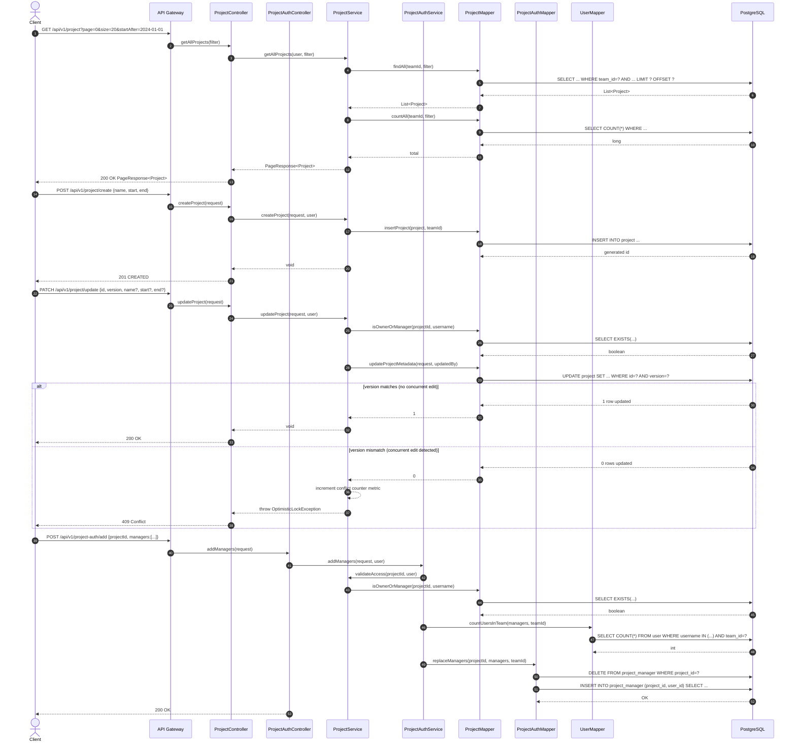
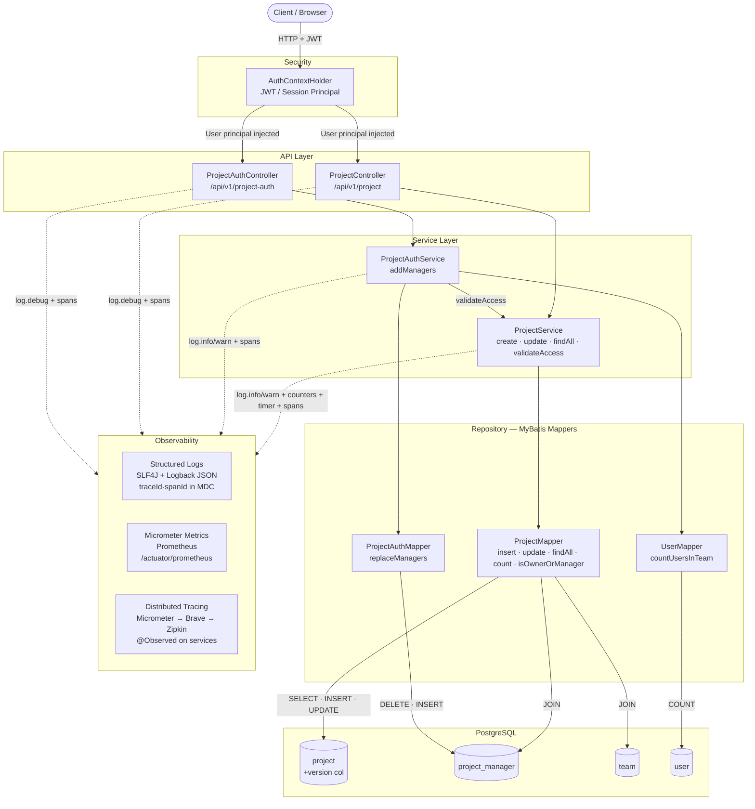

## Sequence Diagram

```mermaid
sequenceDiagram
    autonumber
    actor Client
    participant GW as API Gateway
    participant PC as ProjectController
    participant PAC as ProjectAuthController
    participant PS as ProjectService
    participant PAS as ProjectAuthService
    participant PM as ProjectMapper
    participant PAM as ProjectAuthMapper
    participant UM as UserMapper
    participant DB as PostgreSQL

    %% ── GET All Projects ─────────────────────────────────────────────────────
    Client->>GW: GET /api/v1/project?page=0&size=20&startAfter=2024-01-01
    GW->>PC: getAllProjects(filter)
    PC->>PS: getAllProjects(user, filter)
    PS->>PM: findAll(teamId, filter)
    PM->>DB: SELECT ... WHERE team_id=? AND ... LIMIT ? OFFSET ?
    DB-->>PM: List<Project>
    PM-->>PS: List<Project>
    PS->>PM: countAll(teamId, filter)
    PM->>DB: SELECT COUNT(*) WHERE ...
    DB-->>PM: long
    PM-->>PS: total
    PS-->>PC: PageResponse<Project>
    PC-->>Client: 200 OK  PageResponse<Project>

    %% ── CREATE Project ───────────────────────────────────────────────────────
    Client->>GW: POST /api/v1/project/create  {name, start, end}
    GW->>PC: createProject(request)
    PC->>PS: createProject(request, user)
    PS->>PM: insertProject(project, teamId)
    PM->>DB: INSERT INTO project ...
    DB-->>PM: generated id
    PS-->>PC: void
    PC-->>Client: 201 CREATED

    %% ── UPDATE Project (Optimistic Locking) ──────────────────────────────────
    Client->>GW: PATCH /api/v1/project/update  {id, version, name?, start?, end?}
    GW->>PC: updateProject(request)
    PC->>PS: updateProject(request, user)
    PS->>PM: isOwnerOrManager(projectId, username)
    PM->>DB: SELECT EXISTS(...)
    DB-->>PM: boolean
    PS->>PM: updateProjectMetadata(request, updatedBy)
    PM->>DB: UPDATE project SET ... WHERE id=? AND version=?

    alt version matches (no concurrent edit)
        DB-->>PM: 1 row updated
        PM-->>PS: 1
        PS-->>PC: void
        PC-->>Client: 200 OK
    else version mismatch (concurrent edit detected)
        DB-->>PM: 0 rows updated
        PM-->>PS: 0
        PS-->>PS: increment conflict counter metric
        PS-->>PC: throw OptimisticLockException
        PC-->>Client: 409 Conflict
    end

    %% ── ADD Managers ─────────────────────────────────────────────────────────
    Client->>GW: POST /api/v1/project-auth/add  {projectId, managers:[...]}
    GW->>PAC: addManagers(request)
    PAC->>PAS: addManagers(request, user)
    PAS->>PS: validateAccess(projectId, user)
    PS->>PM: isOwnerOrManager(projectId, username)
    PM->>DB: SELECT EXISTS(...)
    DB-->>PM: boolean
    PAS->>UM: countUsersInTeam(managers, teamId)
    UM->>DB: SELECT COUNT(*) FROM user WHERE username IN (...) AND team_id=?
    DB-->>UM: int
    PAS->>PAM: replaceManagers(projectId, managers, teamId)
    PAM->>DB: DELETE FROM project_manager WHERE project_id=?
    PAM->>DB: INSERT INTO project_manager (project_id, user_id) SELECT ...
    DB-->>PAM: OK
    PAC-->>Client: 200 OK
```

---

## Data Flow Diagram

```mermaid
flowchart TD
    Client([Client / Browser])

    subgraph API["API Layer"]
        PC[ProjectController\n/api/v1/project]
        PAC[ProjectAuthController\n/api/v1/project-auth]
    end

    subgraph Security["Security"]
        AUTH[AuthContextHolder\nJWT / Session Principal]
    end

    subgraph Services["Service Layer"]
        PS[ProjectService\ncreate · update · findAll · validateAccess]
        PAS[ProjectAuthService\naddManagers]
    end

    subgraph Mappers["Repository — MyBatis Mappers"]
        PM[ProjectMapper\ninsert · update · findAll · count · isOwnerOrManager]
        PAM[ProjectAuthMapper\nreplaceManagers]
        UM[UserMapper\ncountUsersInTeam]
    end

    subgraph DB["PostgreSQL"]
        PT[(project\n+version col)]
        PMT[(project_manager)]
        TT[(team)]
        UT[(user)]
    end

    subgraph OBS["Observability"]
        LOG[Structured Logs\nSLF4J + Logback JSON\ntraceId·spanId in MDC]
        MET[Micrometer Metrics\nPrometheus\n/actuator/prometheus]
        TRC[Distributed Tracing\nMicrometer → Brave → Zipkin\n@Observed on services]
    end

    Client -->|HTTP + JWT| AUTH
    AUTH -->|User principal injected| PC
    AUTH -->|User principal injected| PAC

    PC --> PS
    PAC --> PAS
    PAS -->|validateAccess| PS

    PS --> PM
    PAS --> PAM
    PAS --> UM

    PM -->|SELECT · INSERT · UPDATE| PT
    PM -->|JOIN| TT
    PM -->|JOIN| PMT
    PAM -->|DELETE · INSERT| PMT
    UM -->|COUNT| UT

    PS  -.->|log.info/warn + counters + timer + spans| OBS
    PAS -.->|log.info/warn + spans| OBS
    PC  -.->|log.debug + spans| OBS
    PAC -.->|log.debug + spans| OBS
```