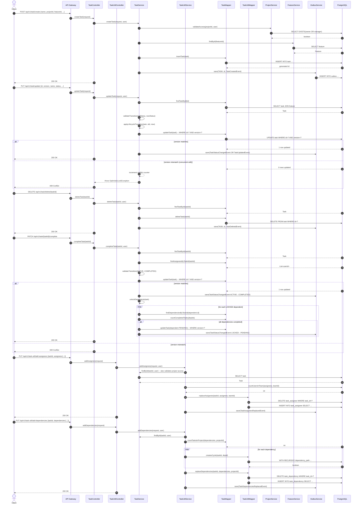
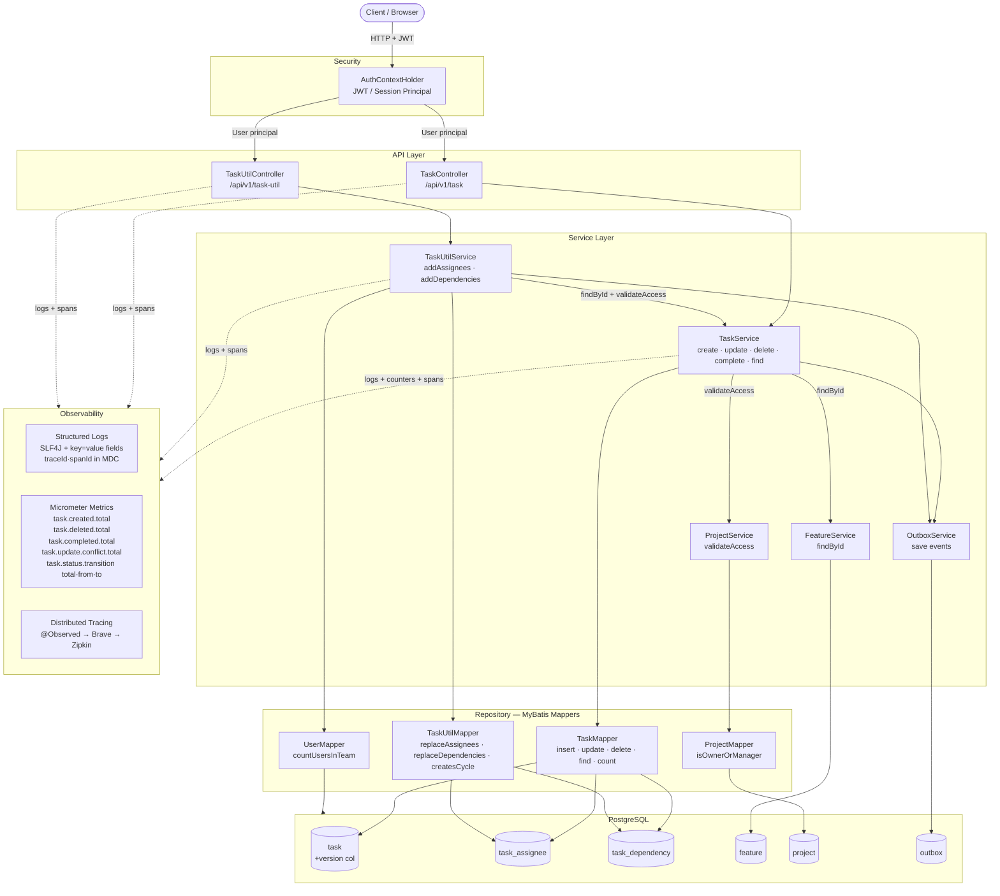
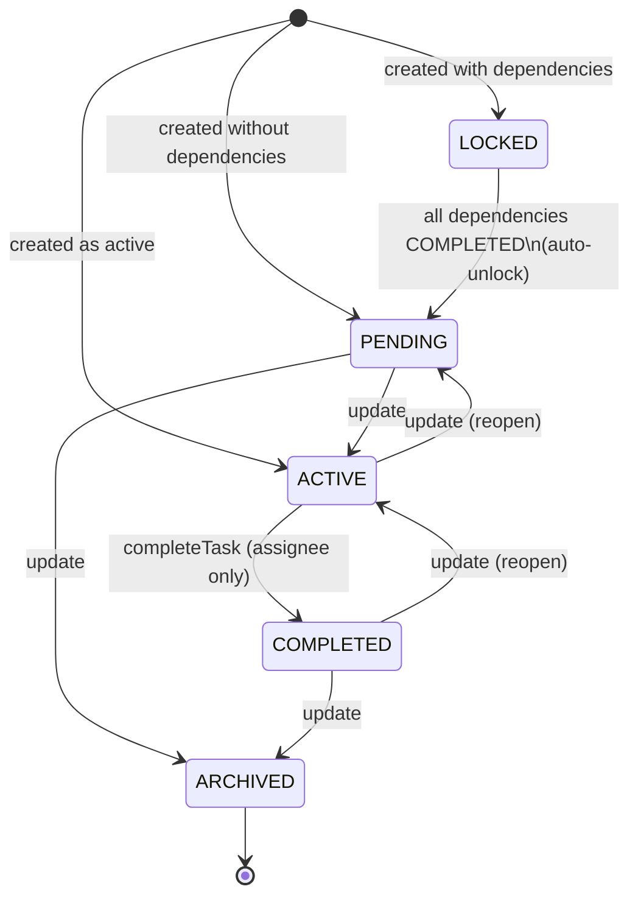

## Task — Sequence Diagram

```mermaid
sequenceDiagram
    autonumber
    actor Client
    participant GW as API Gateway
    participant TC as TaskController
    participant TUC as TaskUtilController
    participant TS as TaskService
    participant TUS as TaskUtilService
    participant TM as TaskMapper
    participant TUM as TaskUtilMapper
    participant PS as ProjectService
    participant FS as FeatureService
    participant OB as OutboxService
    participant DB as PostgreSQL

    %% ── CREATE Task ──────────────────────────────────────────────────────────
    Client->>GW: POST /api/v1/task/create  {name, projectId, featureId, ...}
    GW->>TC: createTask(request)
    TC->>TS: createTask(request, user)
    TS->>PS: validateAccess(projectId, user)
    PS->>DB: SELECT EXISTS(owner OR manager)
    DB-->>PS: boolean
    TS->>FS: findById(featureId)
    FS->>DB: SELECT feature
    DB-->>FS: Feature
    TS->>TM: insertTask(task)
    TM->>DB: INSERT INTO task ...
    DB-->>TM: generated id
    TS->>OB: save(TASK, id, TaskCreatedEvent)
    OB->>DB: INSERT INTO outbox ...
    TC-->>Client: 200 OK

    %% ── UPDATE Task (Optimistic Locking) ─────────────────────────────────────
    Client->>GW: PUT /api/v1/task/update  {id, version, name, status, ...}
    GW->>TC: updateTask(request)
    TC->>TS: updateTask(request, user)
    TS->>TM: findTaskById(id)
    TM->>DB: SELECT task JOIN feature
    DB-->>TM: Task
    TS->>TS: validateTransition(oldStatus, newStatus)
    TS->>TS: applyLifecycleTransition(task, old, new)
    TS->>TM: updateTask(task)  -- WHERE id=? AND version=?
    TM->>DB: UPDATE task WHERE id=? AND version=?

    alt version matches
        DB-->>TM: 1 row updated
        TS->>OB: save(TaskStatusChangedEvent OR TaskUpdatedEvent)
        TC-->>Client: 200 OK
    else version mismatch (concurrent edit)
        DB-->>TM: 0 rows updated
        TS-->>TS: increment conflict counter
        TS-->>TC: throw OptimisticLockException
        TC-->>Client: 409 Conflict
    end

    %% ── DELETE Task ──────────────────────────────────────────────────────────
    Client->>GW: DELETE /api/v1/task/delete/{taskId}
    GW->>TC: deleteTask(taskId)
    TC->>TS: deleteTask(taskId, user)
    TS->>TM: findTaskById(taskId)
    DB-->>TM: Task
    TS->>TM: deleteTask(taskId)
    TM->>DB: DELETE FROM task WHERE id=?
    TS->>OB: save(TASK, id, TaskDeletedEvent)
    TC-->>Client: 200 OK

    %% ── COMPLETE Task ────────────────────────────────────────────────────────
    Client->>GW: PATCH /api/v1/task/{taskId}/complete
    GW->>TC: completeTask(taskId)
    TC->>TS: completeTask(taskId, user)
    TS->>TM: findTaskById(taskId)
    DB-->>TM: Task
    TS->>TM: findAssigneesByTaskId(taskId)
    DB-->>TM: List<userId>
    TS->>TS: validateTransition(ACTIVE, COMPLETED)
    TS->>TM: updateTask(task)  -- WHERE id=? AND version=?

    alt version matches
        DB-->>TM: 1 row updated
        TS->>OB: save(TaskStatusChangedEvent ACTIVE→COMPLETED)
        TS->>TS: unlockDependents(task)
        loop for each LOCKED dependent
            TS->>TM: findDependenciesByTaskId(dependent.id)
            TS->>TM: countCompletedTasks(depIds)
            alt all dependencies completed
                TS->>TM: updateTask(dependent PENDING)  -- WHERE version=?
                TS->>OB: save(TaskStatusChangedEvent LOCKED→PENDING)
            end
        end
        TC-->>Client: 200 OK
    else version mismatch
        TC-->>Client: 409 Conflict
    end

    %% ── ADD ASSIGNEES ────────────────────────────────────────────────────────
    Client->>GW: PUT /api/v1/task-util/add-assignees  {taskId, assignees:[...]}
    GW->>TUC: addAssignees(request)
    TUC->>TUS: addAssignees(request, user)
    TUS->>TS: findById(taskId, user)  -- also validates project access
    TS->>DB: SELECT task
    DB-->>TS: Task
    TUS->>DB: countUsersInTeam(assignees, teamId)
    DB-->>TUS: int
    TUS->>TUM: replaceAssignees(taskId, assignees, teamId)
    TUM->>DB: DELETE task_assignee WHERE task_id=?
    TUM->>DB: INSERT INTO task_assignee SELECT ...
    TUS->>OB: save(TaskAssigneesReplacedEvent)
    TUC-->>Client: 200 OK

    %% ── ADD DEPENDENCIES ─────────────────────────────────────────────────────
    Client->>GW: PUT /api/v1/task-util/add-dependencies  {taskId, dependencies:[...]}
    GW->>TUC: addDependencies(request)
    TUC->>TUS: addDependencies(request, user)
    TUS->>TS: findById(taskId, user)
    TUS->>TM: countTasksInProject(dependencies, projectId)
    DB-->>TM: int
    loop for each dependency
        TUS->>TUM: createsCycle(taskId, depId)
        TUM->>DB: WITH RECURSIVE dependency_path ...
        DB-->>TUM: boolean
    end
    TUS->>TUM: replaceDependencies(taskId, dependencies, projectId)
    TUM->>DB: DELETE task_dependency WHERE task_id=?
    TUM->>DB: INSERT INTO task_dependency SELECT ...
    TUS->>OB: save(TaskDependenciesReplacedEvent)
    TUC-->>Client: 200 OK
```

---

## Task — Data Flow Diagram

```mermaid
flowchart TD
    Client([Client / Browser])

    subgraph API["API Layer"]
        TC[TaskController\n/api/v1/task]
        TUC[TaskUtilController\n/api/v1/task-util]
    end

    subgraph Security["Security"]
        AUTH[AuthContextHolder\nJWT / Session Principal]
    end

    subgraph Services["Service Layer"]
        TS[TaskService\ncreate · update · delete · complete · find]
        TUS[TaskUtilService\naddAssignees · addDependencies]
        PS[ProjectService\nvalidateAccess]
        FS[FeatureService\nfindById]
        OB[OutboxService\nsave events]
    end

    subgraph Mappers["Repository — MyBatis Mappers"]
        TM[TaskMapper\ninsert · update · delete · find · count]
        TUM[TaskUtilMapper\nreplaceAssignees · replaceDependencies · createsCycle]
        UM[UserMapper\ncountUsersInTeam]
        PM[ProjectMapper\nisOwnerOrManager]
    end

    subgraph DB["PostgreSQL"]
        TT[(task\n+version col)]
        TA[(task_assignee)]
        TD[(task_dependency)]
        FT[(feature)]
        PT[(project)]
        OBT[(outbox)]
    end

    subgraph OBS["Observability"]
        LOG[Structured Logs\nSLF4J + key=value fields\ntraceId·spanId in MDC]
        MET[Micrometer Metrics\ntask.created.total\ntask.deleted.total\ntask.completed.total\ntask.update.conflict.total\ntask.status.transition total·from·to]
        TRC[Distributed Tracing\n@Observed → Brave → Zipkin]
    end

    Client -->|HTTP + JWT| AUTH
    AUTH -->|User principal| TC
    AUTH -->|User principal| TUC

    TC --> TS
    TUC --> TUS
    TUS -->|findById + validateAccess| TS
    TS -->|validateAccess| PS
    TS -->|findById| FS

    PS --> PM
    PM --> PT
    FS --> FT

    TS --> TM
    TUS --> TUM
    TUS --> UM

    TM --> TT
    TM --> TA
    TM --> TD
    TUM --> TA
    TUM --> TD
    UM --> DB

    TS --> OB
    TUS --> OB
    OB --> OBT

    TS  -.->|logs + counters + spans| OBS
    TUS -.->|logs + spans| OBS
    TC  -.->|logs + spans| OBS
    TUC -.->|logs + spans| OBS
```

---

## Status Transition Diagram

```mermaid
stateDiagram-v2
    [*] --> LOCKED : created with dependencies
    [*] --> PENDING : created without dependencies
    [*] --> ACTIVE : created as active

    LOCKED --> PENDING : all dependencies COMPLETED\n(auto-unlock)

    PENDING --> ACTIVE : update
    PENDING --> ARCHIVED : update

    ACTIVE --> COMPLETED : completeTask (assignee only)
    ACTIVE --> PENDING : update (reopen)

    COMPLETED --> ACTIVE : update (reopen)
    COMPLETED --> ARCHIVED : update

    ARCHIVED --> [*]
```